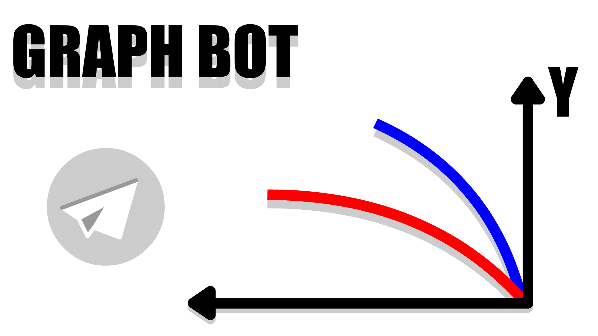

# GraphBOT 📊


Телеграм бот для построения графиков функций и поиска экстремумов методом дихотомии.

Написан на Python с использованием pyTelegramBotAPI и matplotlib.

---

## Что умеет бот

- Строить график любой функции на заданном отрезке
- Находить максимум и минимум функции методом дихотомии
- Сохранять персональный диапазон построения для каждого пользователя

---

## Установка по действиям

**1. Клонирование репозитория**
```bash
git clone https://github.com/[ваш_репозиторий]/TG_bot_Graph_calc.git
cd TG_bot_Graph_calc
```

**2. Установка зависимостей**
```bash
pip install -r requirements.txt
```

**3. Создание `.env` файла для хранения API бота**
```
BOT_TOKEN=[ваш_токен]
```
Токен бота можно получить (зарегестрировать) здесь: [@BotFather](https://t.me/BotFather).

**4. Запуск бота**
```bash
python bot.py
```

Все нужные папки создадутся автоматически при первом запуске, это прописано в bot.py.

---

## Структура проекта

```
TG_bot_Graph_calc/
├── bot.py                      ← основной файл бота
├── logger.py                   ← логирование
├── bot_syntax_info.py          ← текст справки
├── user_settings.json          ← настройки пользователей (создаётся автоматически)
├── requirements.txt
├── .env                        ← токен (создать вручную)
├── logs/
│   └── bot.log
└── src/
    └── graph/
    │   ├── __init__.py
    │   └── graph.py            ← математика и построение графиков
    └── pictures/
        ├── DICHOTOMY.png       ← картинка приветствия
        ├── examples/           ← картинки для раздела "Информация"
        └── users/              ← графики пользователей (создаётся автоматически)
```

---

## Синтаксис функций

| Что вводить | Что означает |
|---|---|
| `x` или `X` | переменная |
| `x^2` или `x**2` | степень |
| `2x`, `2sin(x)` | умножение |
| `\|x\|` или `abs(x)` | модуль |
| `sin(x)`, `cos(x)`, `tan(x)` | тригонометрия |
| `ln(x)` | натуральный логарифм |
| `log(x)` | натуральный логарифм |
| `log2(x)`, `log10(x)`, `logN(x)` | логарифм по основанию N |
| `sqrt(x)` | квадратный корень |
| `exp(x)` | экспонента |
| `pi`, `e` | константы |

Примеры корректного ввода:
```
sin(x) + cos(x)
x^2 + 2x + 1
sqrt(x) + ln(x)
2sin(x)
log2(x^3)
|x - 1|
```

---

## Как работает дихотомия

Метод дихотомии — это способ найти экстремум функции на отрезке. Алгоритм делит отрезок пополам и на каждом шаге оставляет ту половину, где функция "идёт" в нужном направлении.

В боте отрезок дополнительно разбивается на 1000 подотрезков — это позволяет находить глобальный экстремум, а не просто локальный. Это увеличивает время работы программы, но зато корректно считает максимум или минимум на отрезке, чего сложно добиться без этого улучшения

---

## Зависимости

```
pyTelegramBotAPI
python-dotenv
matplotlib
numpy
```

---

## Авторы

_Написание кода, работа с ботом, оптимизация, организация хранения информации о пользователе в едином файле, дизайн изображений, используемых в боте:_
- [>onemoretime](https://t.me/Cnstrct13) _(Telegram)_
- [LizzaOpium](https://github.com/LizzaOpium) _(Github)_

_Организация основной структуры бота, создание репозитория, наставничество:_
- [konech9](https://github.com/konech9) _(Github)_

